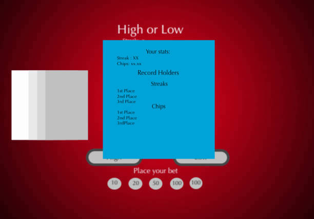

***Julius / Feb 01, 2018***
# Hi-Lo-Game-Project
## Game Description
The premise of the High or Low as you might have guessed already is to guess whether the next card is higher or lower than the last one dealt. That's basically it!. I will do my best to make this game exciting by adding on some dynamics like having lives or limited chances to guess and/or being able to place bets. 
## Wireframe

## Initial Thoughts
Proper planning, time management and execution will be the key to this proect. Project will consist of html, css and Javascript for the programming and the most part so I have to be prepared to put in millions of hours googling syntaxes that I need specially the ones involving math. Debugging and tweaking the code throughout the entire project, until it is fine tuned and works the way that is intended.
## Phases of completion
1. Start
      - start event, gameplay options, build the deck (maybe objects or arrays)
2. Visuals
      - HTML, CSS, DOM
3. Gameplay logic
      - randomize, functions, events, more DOM
4. Check for winner
5. Game Complete
6. Visual Enhancements (if time allows)
## Resources and Tools
- Sublime Text Editor
- https://www.w3schools.com/
- https://stackoverflow.com/
- https://developer.mozilla.org/en-US/docs/Web/JavaScript

 
