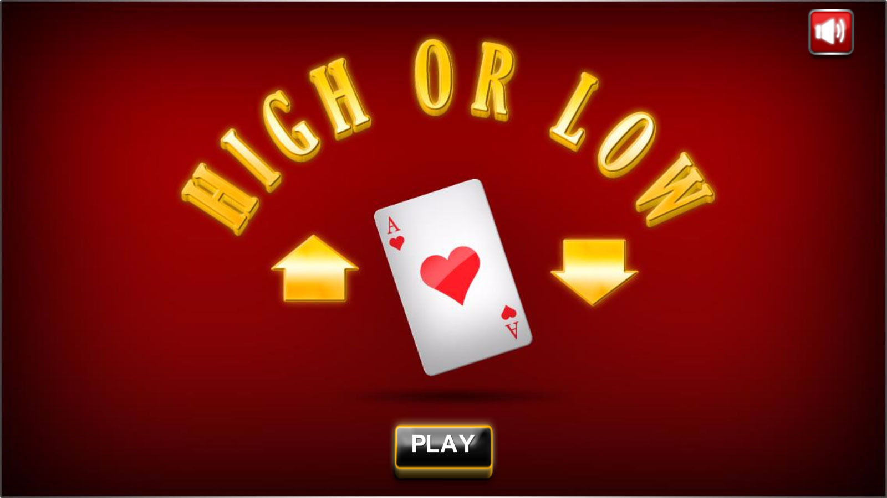

***Julius / Feb 01, 2018***
# Hi-Lo-Game-Project
## Game Description
The premise of the High or Low as you might have guessed already is to guess whether the next card is higher or lower than the last one dealt. That's basically it!. I will do my best to make this game exciting by adding on some dynamics like having lives or limited chances to guess and/or being able to place bets. 
## Wireframe

## Initial Thoughts
Proper planning, time management and execution will be the key to this proect. Project will consist of html, css and Javascript for the programming and the most part so I have to be prepared to put in millions of hours googling syntaxes that I need specially the ones involving math. Debugging and tweaking the code throughout the entire project, until it is fine tuned and works the way that is intended.
## Phases of completion
1. Logic
	- game start, gameplay and game finish 
	  	- arrays, objects, functions statements and events	
2. Visuals 
      - HTML, CSS, DOM
3. Twaking and debugging      
3. Visual Enhancements (if time allows)
## Resources and Tools
- Sublime Text Editor
- https://www.w3schools.com/
- https://stackoverflow.com/
- https://developer.mozilla.org/en-US/docs/Web/JavaScript

## Post Project Thoughts
- feeling both proud and little embarrased
	- proud because looking back to myself before I started this program I could nt have done this all by myself because I have zero knowledge in programming couple of months ago
	- embarrased coz i settled for a very simple game.. now that its finished I now know for myself that I could have pushed myself on writing a more intricate program.
- if you have a plan and proper time management and execution everything is going to come through
- roadblocks will always be there, took advantage of all the resources out there for help and information.
- couple of things in my game that I wanted to do but could not really figure out how to.
	- minor: navbar, flexbox, scoredisplay(i know the code bt could not figure out why it does not dis appear when i want to)
	- major: wanted to reset display of the cards at a certain point but keeping everything else is really a challenge that still needs figuring out (messes up my styles everytime i try something)
- I implemented everything I have learned so far within this class and now have a better understanding on how to apply all ive learned in a program or in the real world 
- Overall I think I could have done better but I am satisfied with what I have acomplished coz I made the game work the way I actually wanted it to.
- rate to myself 4 out of 5

 
